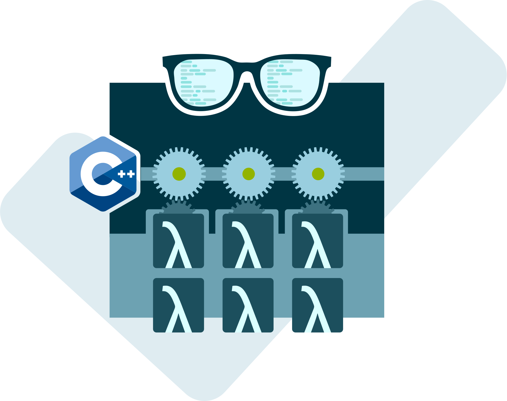

# Thread Pool Party for C++ Nerds

This CMake project serves as a comprehensive example of a thoroughly tested thread pool implementation in modern C++11.

## Usage

Feel at liberty to integrate our thread pool implementation into your C++ project. Simply add this repository as a Git submodule to your project and link `pool_party` to your executable or library.

### Add thread-pool-party-for-cpp-nerds to your cmake

First, clone the repository in an `extern` folder of your cmake
project and add it as a submodule. For more information about
how to use cmake with submodules refer the following:
https://cliutils.gitlab.io/modern-cmake/chapters/projects/submodule.html

Once done, you can link the `pool_party` target to your cmake target.

To integrate the `thread-pool-party-for-cpp-nerds` submodule into your CMake project, begin by cloning the repository into an `extern` folder within your project directory and subsequently adding it as a submodule. For detailed guidance on utilizing CMake with submodules, please refer this link: https://cliutils.gitlab.io/modern-cmake/chapters/projects/submodule.html

Once this process is complete, establish a linkage between the `pool_party` target and your CMake target.

```cmake
add_subdirectory(extern/thread-pool-party-for-cpp-nerds)
target_link_libraries(your_executable_or_library PRIVATE pool_party)
```

### First async steps

To employ the thread pool, refer to the following example:

```cpp
#include "pool_party/thread_pool.hpp"

#include <cstdlib>
#include <iostream>

int main() {
    std::size_t thread_number{6};
    pool_party::ThreadPool pool{thread_number};

    // Add a task to the thread pool
    pool.enqueue([](){
        std::cout << "Task executed\n";
    });

    return EXIT_SUCCESS;
}
```

### Retrieve Task Results

For each task, you can have an individual return type. The subsequent example demonstrates how to obtain a task's result.

```cpp
pool_party::ThreadPool pool{2};

// Enqueue a task and save the future
auto future{pool.enqueue([](){
    // A heavy calculation results in 42
    return 42;
})};

// Blocks until the result is available
auto result{future.get()};

// 'result' now contains 42
```

### Shutdown the Thread Pool

The ThreadPool features a shutdown implementation that responsibly handles the processing of remaining tasks and concludes the workers' functions.

Once the pool has been shut down, it is prohibited to add further tasks. Attempting to add more tasks to a shutdown thread pool results in a corresponding exception.

The subsequent example demonstrates how to shut down a thread pool:

```cpp
{
    pool_party::ThreadPool pool{2};

    // Add tasks to the pool ...

    pool.shutdown();

    // Pool workers finish remaining work
    // Blocks here until work is done
}

// The pool is out of scope, and workers are joined properly
```

Feel free to explore the full capabilities of the thread pool, incorporating its features into your projects to enhance concurrency and performance in your C++ applications.

## Contribution

Your thoughts and suggestions are invaluable. If you have ideas for enhancing this project, don't hesitate to open an issue or, even better, initiate a pull request.

For an optimal development environment, we recommend utilizing Visual Studio Code's DevContainer feature. This feature creates and attaches to a container with predefined dependencies, ensuring that your system remains uncluttered.

To get started, clone the repository, open the folder in VS Code, and execute `Dev Containers: Open Workspace in Container`.

After a short duration, your working environment should be ready.

To build `thread-pool-party-for-cpp-nerds`, follow these steps:

```bash
cmake -S . -B build -GNinja
cmake --build build

# Run the tests
./build/tests/unit/poolparty_unit_tests
./build/tests/integration/poolparty_integration_tests
```

## Authors

This implementation is a creation of RAIISoft GmbH, nurtured by two German C++ enthusiasts. We find joy in the intricacies of C++ and are open to relaxed tea sessions for discussions on the language and contract development.

For any queries or simply to connect, you can drop us an email at info@raiisoft.de or visit our [contact form](https://raiisoft.de/en/contact). Your inquiries and conversations are warmly welcomed.
